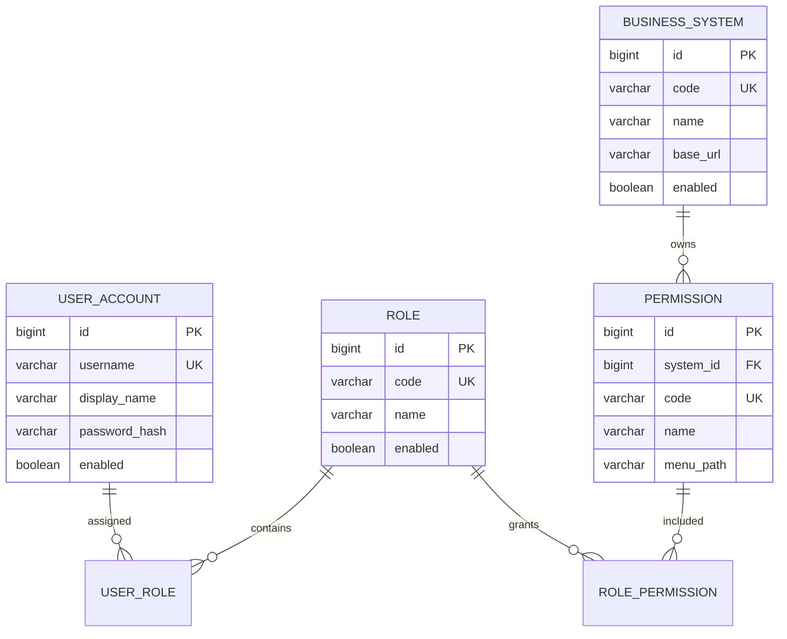

# 统一权限管理系统 RBAC0 设计说明

## 1. 建设目标

本项目为集团业务系统提供统一账号、角色和菜单权限服务。员工使用统一账号登录，业务系统通过 API 获取用户权限并在后端再次校验；管理员通过权限管理 API 配置用户、角色、业务系统和菜单权限。

本阶段按老师要求完成可运行的 RBAC0 基础版本，重点验证“用户分配多个角色后，权限取并集；回收角色后，后续请求立即重新校验”。OA 审批、HR 同步和各业务系统的页面接入属于后续集成工作。

## 2. 分层结构

```text
HTTP 请求
   ↓
Controller：DTO 接收、参数校验、HTTP 状态码
   ↓
Service：RBAC0 规则、登录、权限并集、密码摘要、JWT
   ↓
Repository：Spring Data JPA 数据访问
   ↓
H2（本地）/ MySQL（生产）
```

Controller 不直接访问数据库；Service 负责 DTO、实体和响应对象之间的转换；Repository 只负责持久化查询。

## 3. RBAC0 模型



一条权限表示一个允许执行的菜单或接口操作，例如 `expense:list`。RBAC0 只表达允许，没有拒绝规则和角色继承规则。

用户的有效权限计算规则为：

```text
用户的有效权限 = 用户所有启用角色的权限并集（按权限 code 去重）
```

用户、角色或业务系统被禁用后，相关登录或权限查询立即受到影响。受保护业务接口每次请求重新读取当前权限，因此回收角色后后续请求会返回 `403`。

## 4. 主要数据表

| 表 | 作用 | 关键约束 |
|---|---|---|
| `sys_user` | 员工账号、显示名称、BCrypt 密码摘要、启用状态 | `username` 唯一 |
| `sys_role` | 岗位角色，例如财务查看员 | `code` 唯一 |
| `biz_system` | OA、财务系统等业务系统 | `code` 唯一 |
| `sys_permission` | 业务系统菜单或接口权限 | `code` 唯一，关联业务系统 |
| `sys_user_role` | 用户与角色多对多关系 | `(user_id, role_id)` 唯一 |
| `sys_role_permission` | 角色与权限多对多关系 | `(role_id, permission_id)` 唯一 |

生产环境使用 [database-mysql.sql](database-mysql.sql) 建表。当前项目没有把三份 Excel 直接写入数据库；Excel 数据应在字段确认后通过导入程序或批量 API 导入。

## 5. 业务流程

### 5.1 登录与调用业务系统

1. 用户调用 `POST /api/auth/login` 提交用户名和密码。
2. 服务使用 BCrypt 校验密码，返回用户信息、有效权限和 JWT。
3. 业务系统把 JWT 放入 `Authorization: Bearer <token>` 请求头。
4. 受保护 API 校验 JWT 签名、过期时间和注销状态，再检查当前用户是否拥有目标权限。

### 5.2 权限配置

1. 创建业务系统、角色和菜单权限。
2. 为角色分配权限。
3. 为用户分配角色。
4. 通过 `GET /api/users/{userId}/permissions` 查看权限并集。

### 5.3 调岗和回收

原部门完成交接后调用删除用户角色接口；新部门再分配新角色。业务接口每次请求重新检查权限，所以回收后不需要等待 JWT 过期才能阻止后续操作。

### 5.4 OA 协同边界

OA 负责申请和审批，审批通过后调用本系统的角色分配或回收 API。本项目当前提供执行权限变更的基础 API，审批单号、调用方签名和部门管理员范围属于下一阶段的接入增强。

## 6. API 分组

| 分组 | 典型接口 |
|---|---|
| 健康检查 | `GET /hello` |
| 认证 | `POST /api/auth/login`、`POST /api/auth/logout` |
| 用户 | `/api/users` |
| 角色 | `/api/roles` |
| 业务系统 | `/api/systems` |
| 权限 | `/api/permissions` |
| 关系维护 | `/api/users/{id}/roles/{roleId}`、`/api/roles/{id}/permissions/{permissionId}` |
| 后端校验示例 | `GET /api/demo/expenses`，需要 `expense:list` |

完整请求顺序见 [rbac-api.md](rbac-api.md)，可直接导入 Postman 的验收集合见 [postman/unified-permission-system.postman_collection.json](postman/unified-permission-system.postman_collection.json)。

## 7. 安全与部署设计

- 密码只保存 BCrypt 摘要，不返回密码字段。
- JWT 使用 HMAC 密钥签名，生产环境通过 `PERMISSION_JWT_SECRET` 注入至少 32 字节的密钥。
- 多个应用实例必须使用相同的 JWT 密钥；数据库使用同一个 MySQL 实例或集群。
- 本地默认使用 H2 内存数据库，应用停止后数据清空；生产环境使用 `prod` 配置和 MySQL。
- 当前注销黑名单保存在应用实例内存中，单实例演示可用；多实例正式部署时应改为 Redis 或共享持久化存储。
- 当前版本没有宣称达到 20 毫秒指标，也没有完成一万并发压测；性能指标需要在部署拓扑、数据量和压测工具确定后单独测量。

两台服务器的角色划分和启动命令见 [deployment-two-servers.md](deployment-two-servers.md)。

## 8. 验收场景

1. 创建用户、业务系统、角色和 `expense:list` 权限。
2. 给角色分配权限，再给用户分配角色。
3. 用户登录，确认返回 JWT 和 `expense:list`。
4. 携带 JWT 请求 `/api/demo/expenses`，返回 `200`。
5. 回收用户角色后再次请求，返回 `403`。
6. 登录得到的新 JWT 调用注销接口，再次请求返回 `401`。

该场景同时验证登录、JWT、角色权限并集、实时回收和后端权限校验。

## 9. 本阶段与后续范围

本阶段已完成：RBAC0 基础模型、六张核心表、CRUD、角色和权限关系、BCrypt 登录、JWT 校验、MySQL 建表脚本和 Postman 验收流程。

后续可按优先级增加：HR 员工同步、部门管理员范围、OA 审批单号和调用签名、共享注销存储、管理员网页、审计日志和压测报告。
